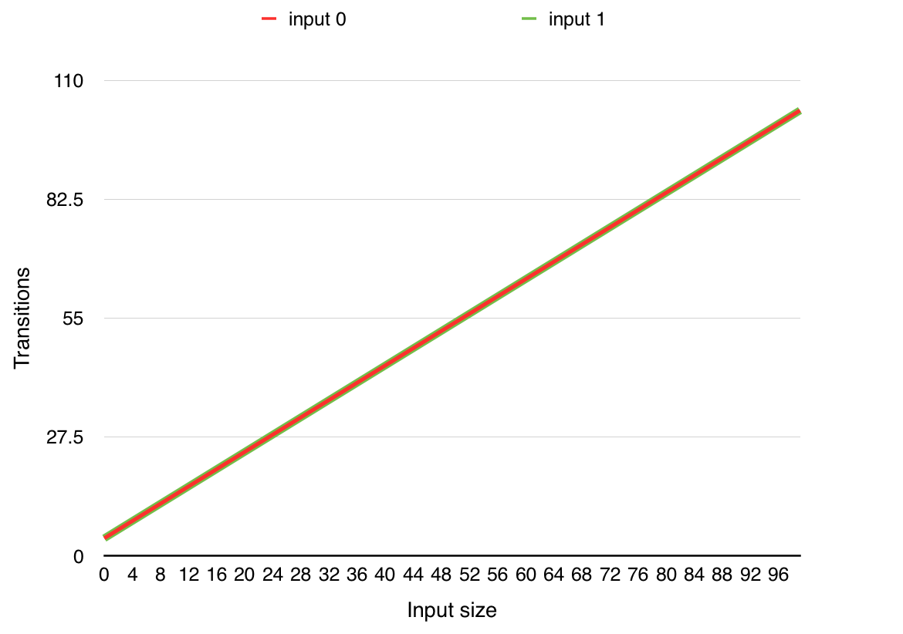
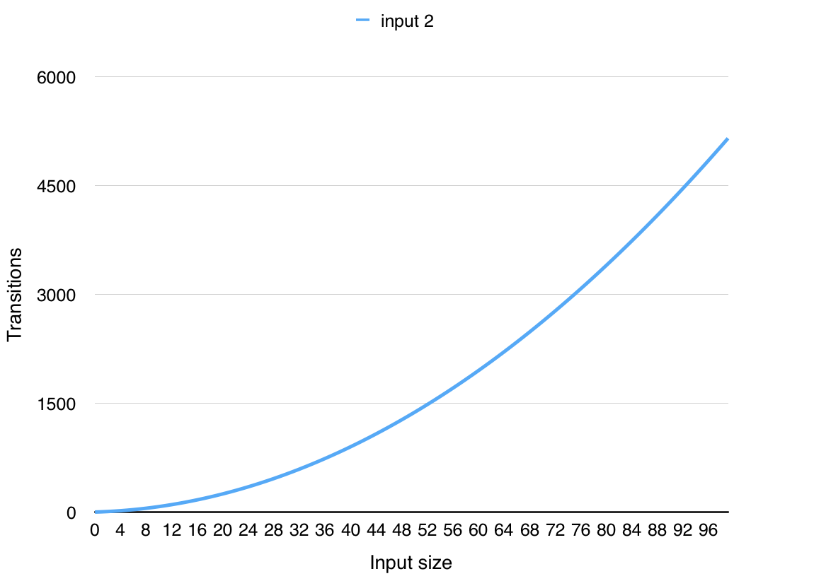
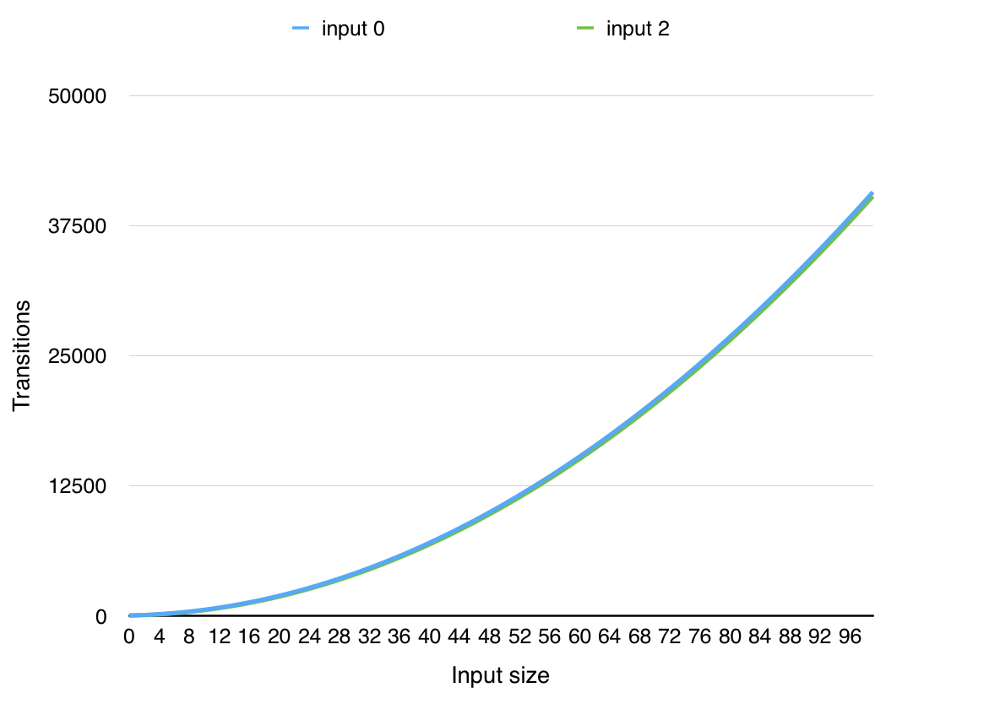
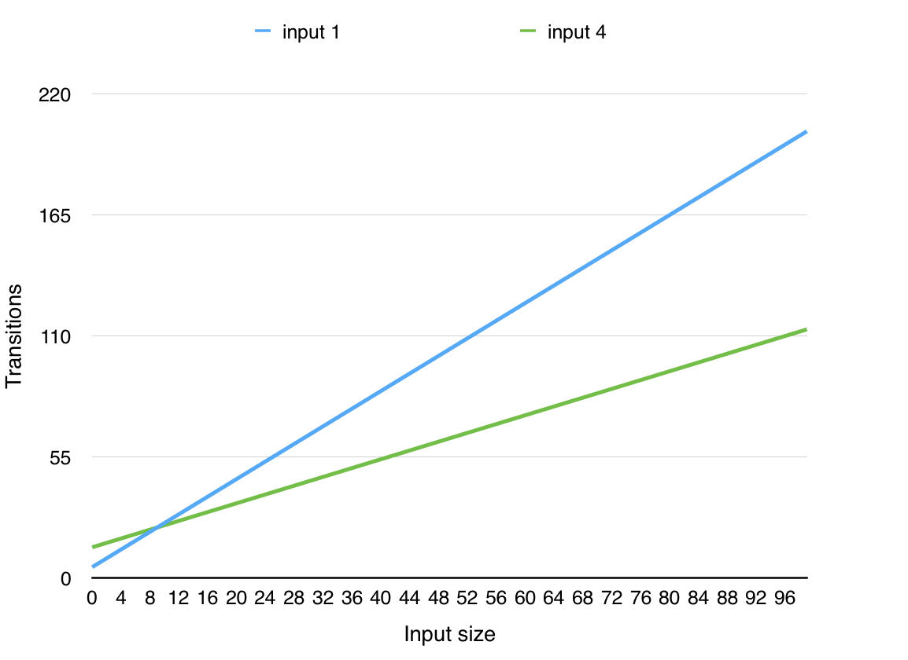
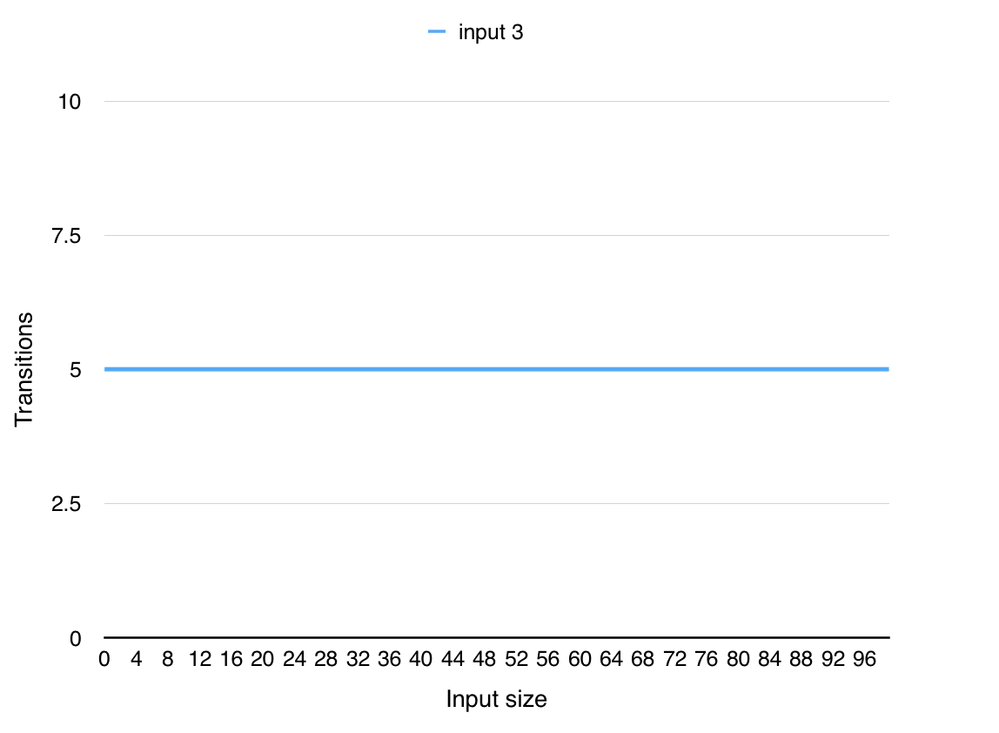
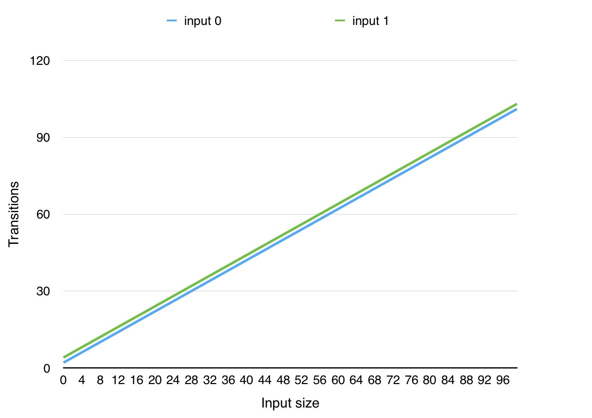
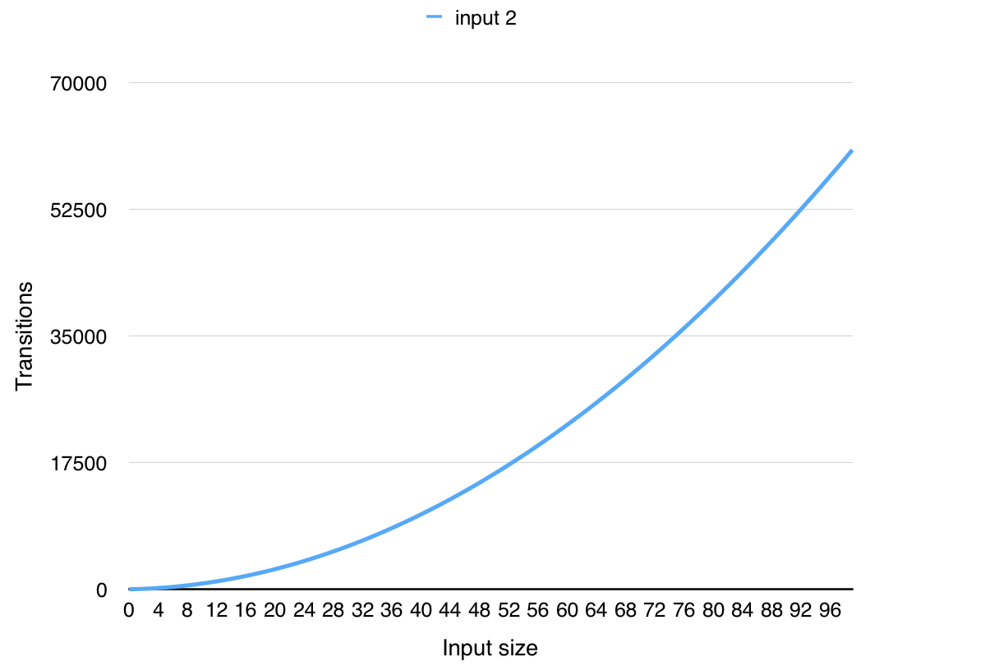
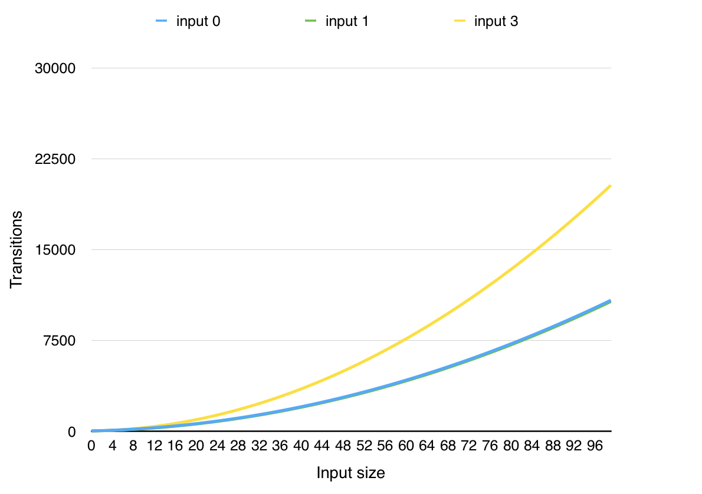
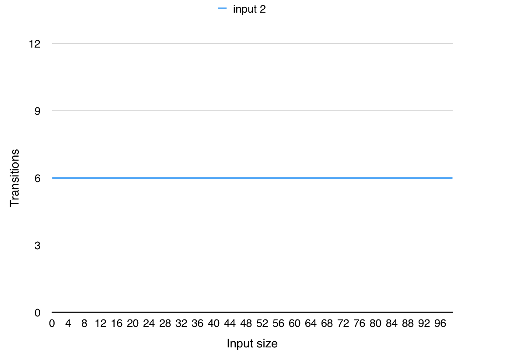
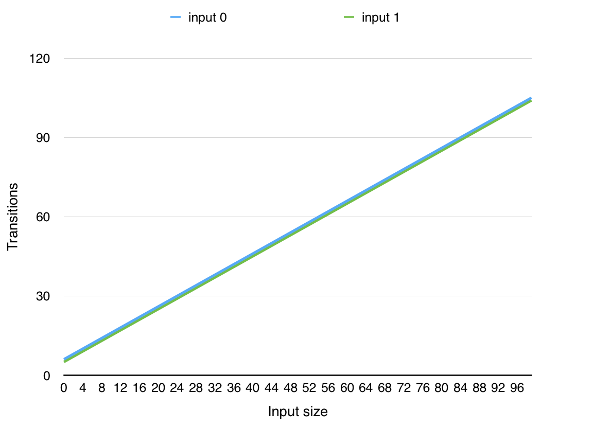

% CS3052 Practical 1 Report
% 140015533
% 28 February 2017

# Overview

This practical explores implementing Turing machines in a programming language of my choice and programming them to solve various problems.

My solutions are then tested for correctness and their performance is analysed in terms of the input size and number of transitions taken by the machine.

# Turing Machine Simulation

## Design

I split the program into a number of logical parts. The first one is the tape. It can hold a (potentially) infinite number of cells and has read and write operations. Reading an empty cell succeeds, but an empty value is returned.

The head remembers its position on the tape and can move either left or right. If the head is at the first cell and it is moved left, it remains on the same cell.

Transitions are specified using a transition function. Transition function is created from a transition table.

Tape, head and transition function are used in a Turing machine. Each machine has a start, accept and reject state and a transition function.

The machine can be executed on an input. For each input it creates a new tape and head and remembers its current state. This means that the machine can be re-used for different inputs.

Parser reads a file that has the specified format for describing a Turing machine and produces a Turing machine. It verifies the machine definition as it is parsing it - it validates each row in the transition table.

## Implementation

I implemented the simulator and all analysis scripts in Python 3.

The tape is implemented using a Python dictionary. The keys in the dictionary are the cell positions and the values are the letters in the cells. Using a dictionary lets me to write to any position on the tape without having to fill gaps (as I would have to with a list, for example).

The transition table is another dictionary, where the key is a tuple (state, letter) and the value another tuple (next state, new letter, direction). This dictionary is then used by the transition function to look up transitions.

The Turing machine runs in a while loop that keeps calling the transition function until the machine ends up in either accept or reject state. The head and tape is created for each run, so the machine can be reused for different inputs. It can also output debug information as it is running. This is enabled by setting the `TM_DEBUG` environment variable to any value.

Parsing code reads the definition file line by line and tries to parse these lines using the `str#split` method and assigning the result to multiple variables. It checks for any errors while doing that and throws a `ParseError` if the definition file has invalid format. It includes multiple checks, for example:

* States in the transition table are listed in the states list
* Letters in the transition table are present in the alphabet
* Actual number of letters in the alphabet is the same as specified in the file
* Exactly one accept and reject state is defined
* Transition table contains the required number of rows

I have used Python type hints in the code for better clarity and so that I could use a type checker and autocomplete in my IDE.

## Testing

I have written unit tests for each part of the program, so I can be sure that the simulator works correctly and all edge cases are handled. This also forced me to separate the program into small, independent parts that can be tested easily.

All tests for the program can be found in the `turingmachine/test` directory.

I ran the tests during development to verify the initial implementation and check that any changes do not break the program.

# Solutions to Problems

The Turing machine definition files are located in the `solutions` directory.
I have also included my scanned diagrams for each solution as PDFs next to the definition files.

## Palindromes

The Turing machine for recognising palindromes goes through the input from one side to the other, comparing each half of the input with the other. It stops if there is a mismatch in one letter.

The algorithm works as follows:

1. If there are no letters on the tape, accept.
2. Read a letter, remember it and mark it.
3. Go right until the end of the tape, or until a marked letter is found.
4. Go one cell left and check if the letter matches the remembered letter.
    1. If it does, mark it.
    2. If not, reject.
5. Go left until a marked letter is found.
6. Go one cell right and go back to 2.
7. Repeat while there are unmarked letters. If there are only marked letters, accept.

## Binary Addition

Binary addition is not a hard problem, but it requires a lot of states, so that the machine can remember the digits that are being added.

The machine also needs to handle carry bits correctly. Numbers can be prefixed with any number of 0s, and the three numbers in the input may not have the same number of digits.

The high-level description of my machine is as follows:

1. In the first number find a digit and remember it.
    1. If there are no digits left in the number, remember 0.
2. In the second number find another digit and remember it.
    1. If there are no digits left in the number, remember 0.
3. Add the numbers (and the carry bit, if it was set previously) and check if the corresponding digit in the third number matches.
    1. If there are no digits left in the number, check if the added digits were both 0.
    2. If it does not match, reject.
4. If the resulting sum was larger than 1 (i.e. 10 or 11), remember the carry bit for the next addition.
5. Mark all digits that were added in this iteration and start over.
6. Repeat until there are no digits left in the first and second numbers.
7. If the carry bit is set, check if the third number has an unmarked 1 left.
    1. If yes, mark it.
    2. If not, reject.
8. Check there are only either no digits or just unmarked 0s in the third number.
    1. Reject if not.
9. Accept.

The carry bit is stored in the second \# sign on the tape. If the carry bit is set, the letter is replaced with \&.

## Insertion Sort

This is the solution to the first problem I came up with. The problem is to sort a list of elements (digits 1, 2 or 3) placed on the tape and accept after the list is sorted. The list is sorted in-place, so the resulting sorted list remains on the tape after the machine accepts.

The recognised language for the Turing machine is

$$\{\#w\# | w \in \{1,2,3\}\ast\}$$

The insertion sort algorithm is implemented as follows:

1. Assume that the list is already sorted and go through it from left to right.
2. If an out-of-order element is found, remember it and replace it by the expected element (e.g. $11223341 \rightarrow 11223344$).
    3. Put the out-of-order element where it belongs, replacing another element ($11223344 \rightarrow 11123344$).
    4. Replace elements so that the tape has the same numbers of elements as before ($11123344 \rightarrow 11122334$).
    5. Continue looking for out-of-order elements.
6. If all elements are in the correct order, accept.

## Substring

This machine recognises languages of the form

$$\{\#w_1\#w_2\# | \text{$w_1$ is a substring of $w_2$}\}$$

In other words, it has two strings as the input, and it determines whether the first string is located somewhere in the second string.

The high-level description of the machine is as follows:

1. Check that there are some unmarked letters in the first string.
    2. If not, accept.
2. Find the first unmarked letter in the first string, remember it and mark it.
3. Find the first unmarked letter in the second string and compare it with the other letter.
    4. If they are equal, mark it and go to 1.
    5. If they are not, unmark all marked letters on the tape and delete the first letter of the second word. Go to 2.

The machine deletes the first letter of the second word when it is sure that the letter is not the first letter of the first string in the second string. This lets the machine recognise inputs such as `#110#1110#`, where only a part of the first string is included in the second string.

## Divisible by 4

The input language for this machine has the form

$$\{\#w\# | w \in \{0, 1, ..., 9\}\ast; \text{w is divisible by 4}\}$$

It will recognise any number that is divisible by 4, using the rule that the number consisting of the last two digits must be divisible by 4. The machine looks at the last two digits and determines whether their combination is divisible by 4.

## Testing

Each Turing machine is checked with automated tests that run it on different inputs and check that it accepts/rejects. For the insertion sort machine the resulting tape is also checked.

The tests are located in the `solutions/test` directory.

I have tried to test the regular and all edge cases for each solution, so I could be sure that my solutions correctly solve the given problems. The tested inputs are commented in the test files.

# Analysis

I have created a number of series of inputs for each solution. The inputs in a series grow linearly and all have a common characteristic (e.g. all are palindromes). These series are generated procedurally using Python generators.

Then I let the machine run on first 100 inputs in each series and counted the number of transitions the machine makes for each input. The output of the analysis program is a CSV file, with a column for each series and a row for each analysed input.

For example, for the palindromes solution the output file begins like this:

```
n,input 0,input 1,input 2
0,4,4,3
1,5,5,6
2,6,6,10
3,7,7,15
4,8,8,21
5,9,9,28
```

The first column, `n` is the position of the analysed input in its series. The other numerical values are numbers of transitions.

The analysis scripts are in the `analysis` directory and the collected data is located in the `data` directory.

## Palindromes

In the solution the machine needs to go back and forth through the tape for each letter in the first half of the input.

This means that if the input is a palindrome, the program has time complexity $O(n^2)$, as this is the worst case - the head needs to go through the whole tape twice ($2n$ transitions) for each letter in a half of the input ($\frac{n}{2}$ transitions). We can see this in Figure \ref{fig:palindromeworst}.

The best case is when the input is not a palindrome, and the first and last letters do not match. In this case the machine only goes through the whole tape once ($n$ transitions), resulting in $O(n)$ time complexity, as shown in Figure \ref{fig:palindromebest}.

The series of inputs used for measurements are:

* Input 0: ab, aab, aabb, aaabb, ...
* Input 1: ab, aab, aaab, aaaab, ...
* Input 2: a, aa, aaa, aaaa, ...

Inputs 0 and 1 are both not palindromes, and the first and last letters do not match, resulting in the $O(n)$ time complexity in Figure \ref{fig:palindromebest}. Input 2 is a palindrome, which is the worst case for the algorithm.

{width=60%}

{width=60%}

## Binary Addition

The Turing machine for binary addition checks each digit of the three numbers that are provided as input. This means that it goes through the tape from start to end for each digit in the first or second number (depending on which one is longer). This results in the $O(n^2)$ time complexity (shown in Figure \ref{fig:additionpolynomial}) if the sum is correct (Input 0), or if only the most-significant bit in the sum is incorrect (Input 2).

If the sum is not correct, and the least-significant bit in the third number is wrong, the machine only goes through the first and second number. As a result, the number of transitions taken grows linearly on the size of these two numbers. The $O(n)$ time complexity can be seen for Input 1 in Figure \ref{fig:additionlinear}.

When we prefix any of the numbers with 0 (resulting in the same number, but with different length), the machine needs to make a transition for each of the extra 0s. This is demonstrated in Figure \ref{fig:additionlinear} for Input 4, where the first and second numbers have constant length, but the third one grows linearly by adding 0s. In this case the machine needs to go through the added 0s to make sure there is not a 1 at the end, making the sum invalid.

If the first and second numbers have a constant length, only the third number grows linearly, and the sum is always incorrect at the least-significant bit, the machine will take a constant number of transitions. This is because it only goes through the first two numbers before determining the sum is wrong. All remaining numbers in the third number are ignored. This can be seen in Figure \ref{fig:additionconstant}.

The input series used are:

* Input 0: 0#1#1, 00#11#11, 000#111#111, ...
* Input 1: 0#1#0, 00#11#01, 000#111#011, ...
* Input 2: 0#1#0, 00#11#10, 000#111#110, ...
* Input 3: 0#1#0, 0#1#00, 0#1#000, ...
* Input 4: 0#1#1, 0#1#10, 0#1#100, ...

Input 0 has the correct sum and the size of each number grows linearly. Input 1 has linearly growing numbers, but the least-significant bit in the sum is incorrect. Input 2 grows linearly as Input 0, but the most-significant bit in the sum is incorrect. First two numbers in Inputs 3 and 4 are constant size, but the third number grows linearly. Sum in Input 3 is correct, sum in Input 4 is not.

{width=60%}

{width=60%}

{width=60%}

## Insertion Sort

Performance for the insertion sort Turing machine is the same as the performance of the insertion sort algorithm.

In the best case all elements are already sorted and the machine only goes through the tape once, resulting in $O(n)$ as seen in Figure \ref{fig:sortbest}.

The performance gets gradually worse as the list becomes less sorted. If the elements in the list are in the reverse order (e.g. 332211) the performance is reduced to $O(n^2)$, since the machine goes through the tape for each element that is out of order. This is shown in  Figure \ref{fig:sortworst}.

The input series used are:

* Input 0: ##, #1#, #11# #111#, ...
* Input 1: #13#, #113#, #1113#, ...
* Input 2: #321#, #332211#, #333222111#, ...

Inputs 1 and 2 are already sorted, Input 2 is in reversed order.

{width=60%}

{width=60%}

## Substring

The substring Turing machine needs to go through the tape twice for each letter in the second string. This means that the time complexity will be $O(n^2)$ in the worst case, when the machine has to go through the whole second string. We can see this in Figure \ref{fig:substringpolynomial} where Inputs 0 and 1 are shown. The first string in these inputs is fixed, but the second one grows linearly and the machine needs to go through it (going back and forth through the tape for each letter, to look at the searched substring) to either accept or reject.

If both strings are equal and their size grows linearly, the time complexity remains $O(n^2)$, but as we can see for Input 3 in Figure \ref{fig:substringpolynomial}, it grows faster than when the first string has a fixed size. This is due to the fact that the number cells the machine has to go through is higher.

If the first string has only one letter and the second string contains the letter at the beginning, the time complexity becomes $O(1)$. This is because the machine needs to look only at the first letter of the second string to determine that it contains the searched letter. This can be seen in Figure \ref{fig:substringconstant}.

Input series used for the analysis:

* Input 0: #0#1#, #0#11#, #0#111#, ...
* Input 1: #0#0#, #0#10#, #0#110#, ...
* Input 2: #0#0#, #0#00#, #0#000#, ...
* Input 3: #0#0#, #00#00#, #000#000#, ...

The second string in Inputs 0 and 1 grows linearly, while the first string remains fixed. Input 0 is rejected, Input 1 accepted. The second string in Input 2 grows linearly, but the first string is located at the start of the second string. In Input 3 both strings are equal and grow linearly.

{width=60%}

{width=60%}

## Divisible by 4

This machine will always have the $O(n)$ time complexity, because it always goes through the whole tape once to find the last two digits. We can see this in Figure \ref{fig:division}.

This could be optimised by reversing the order of numbers on the tape, lowering the time complexity to $O(1)$.

Inputs series used for the analysis:

* Input 0: #12#, #112#, #1112#, #11112#, ...
* Input 1: #15#, #115#, #1115#, #11115#, ...

Both inputs grow linearly. Input 0 is divisible by 4, Input 4 is not.

{width=60%}

# Conclusion

I implemented a one-tape deterministic Turing machine simulator that loads a Turing machine definition from a file, read the input and simulate the machine on the input.

Then I designed solutions to problems that can be solved using Turing machines, translated the solutions into the specified text format and checked their correctness automatically.

Finally, I analysed the performance of my solutions for various types and sizes of inputs. I determined time complexities for each of the input types and shown that the complexities are correct by plotting the input size and number of transitions taken.

I have experienced some difficulties when programming Turing machines - the automated tests for my initial solutions have shown bugs in them, but I was able to solve all of them with the help of the debug mode.

Overall, this was an interesting exercise in how Turing machines work and how to program them to solve various problems.
